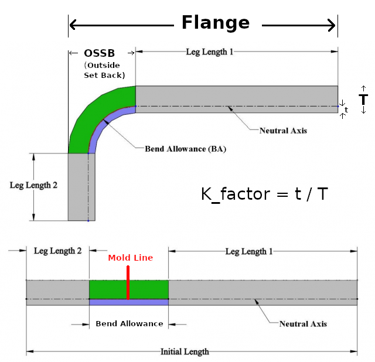

# FreeCAD SheetMetal Workbench
A simple sheet metal workbench for FreeCAD

#### Developers:
* Folding tools:  
                  - Shai Seger [@shaise](https://github.com/shaise)  
                  - [@jaisekjames](https://github.com/jaisekjames)  
                  - Cerem Cem ASLAN [@ceremcem](https://github.com/ceremcem)  
                  - Based and inspired by Javier Martínez's ([@JMG1](https://github.com/JMG1)) code
* Unfolding tool:  
                  - Copyright 2014 by Ulrich Brammer <ulrich1a[at]users.sourceforge.net> AKA [@ulrich1a](https://github.com/ulrich1a)

# Terminology 

# Test case 

As a simple test case, consider the following example: 

* Inputs: 
    - Thickness: 2mm  
    - K-factor: 0.38 (ANSI)  
    - Leg length: 48.12mm  
    - Inner effective radius: 1.64mm  
    - Flange length: 51.76mm  
* Output:  
    - End to mold-line distance: 50mm  

You can find a simple calculator in `./tools/calc-unfold.py`. 

# Material Definition Sheet 

You can use a Spreadsheet object to declare K-factor values inside the project file permanently. This will allow: 

* Different K-factor values to be used for each bend in your model 
* Sharing the same material definition for multiple objects 

To use the Material Definition Sheet, follow the steps:

1. Determine your material name (eg. `foo`)
2. Create a spreadsheet with the name of `material_foo`
3. Create a table layout in `material_foo`, like the following (see [this table](https://user-images.githubusercontent.com/6639874/56498031-b017bc00-6508-11e9-8b14-6076513d8488.png)):

    | Radius / Thickness | K-factor | | Options | | 
    | ---| ---| --- | --- | --- |
    | 1 | 0.38 | | K-factor standard | ANSI |
    | 3 | 0.43 | | | |
    | 99 | 0.5 | | | |
    
    Notes: 
    
    1. The cell names are case/space sensitive.
    2. Possible values for `K-factor standard` is `ANSI` or `DIN`. 
    3. `Radius / Thickness` means `Radius over Thickness`. Eg. if inner radius is `1.64mm` and material thickness is `2mm` then `Radius / Thickness == 1.64/2 = 0.82` so `0.38` will be used as the K-factor. See [lookup.py](https://github.com/ceremcem/FreeCAD_SheetMetal/blob/k-factor-from-lookup/lookup.py#L46-L68) for more examples.

4. Use "Unfold Task Panel" to assign the material sheet.
5. Unfold as usual.

[Here](https://user-images.githubusercontent.com/6639874/56642679-a749f600-6680-11e9-944a-82e447d9dc4e.gif) is a screencast in action.
 
#### Installation
For installation and how to use, please visit:  
http://theseger.com/projects/2015/06/sheet-metal-addon-for-freecad/  
Starting from FreeCAD 0.17 it can be installed via the [Addon Manager](https://github.com/FreeCAD/FreeCAD-addons) (from Tools menu)

#### References
* Development repo: https://github.com/shaise/FreeCAD_SheetMetal  
* FreeCAD wiki page: https://www.freecadweb.org/wiki/SheetMetal_Workbench  
* Authors webpage: http://theseger.com/projects/2015/06/sheet-metal-addon-for-freecad/  
* FreeCAD Forum announcement/discussion [thread](https://forum.freecadweb.org/viewtopic.php?f=10&t=11303) 

#### Release notes: 
* V0.2.31 24 Apr 2019:  Added better K factor control by ceremcem. Thank you!
* V0.2.30 30 Mar 2019:  Added Fold-on-sketch-line tool by jaisejames. Thank you!
* V0.2.22 24 Jan 2019:  Fix some typos, Issue #54
* V0.2.21 20 Jan 2019:  Fix some typos, Issue #52
* V0.2.20 10 Jan 2019:  Added sheetmetal generation from base wire by jaisejames. Thank you!
* V0.2.10 01 Nov 2018:  Merge new features by jaisejames. Thank you!
** Added Edge based selection
** Added Auto-mitering
** Added Sketch based Wall
** Added Sketch based Guided wall
** Added Relief factor
** Added Material Inside, thk inside, Offset options
* V0.2.04 21 Sep 2018:  Fix K-Factor bug
* V0.2.03 20 Sep 2018:  Merge easyw PR: Add separate color for inner sketch lines. (issue #46). Change Gui layout
* V0.2.02 15 Sep 2018:  Add color selection for unfold sketches (issue #41)
* V0.2.01 15 Sep 2018:  Fix bug when not generating sketch (issue #42). Support separate color for bend lines (issue #41)
* V0.2.00 04 Sep 2018:  Make SheetMetal compatible with Python 3 and QT 5
* V0.1.40 20 Aug 2018:  Merge Ulrich's V20 unfolder script - supports many more sheet metal cases and more robust
* V0.1.32 25 Jun 2018:  New feature: Option to separately unfold bends. Thank you jaisejames!
* V0.1.31 25 Jun 2018:  Support ellipses and parabolas, Try standard sketch conversion first
* V0.1.30 25 Jun 2018:   
New feature: Generate unfold sketch with folding marks. Issue #33. Thank you easyw-fc!  
New feature: K-Factor foe unfolding is now editable. Issue #30  
* V0.1.21 19 Jun 2018:  Fixed back negative bend angles, restrict miter to +/- 80 degrees
* V0.1.20 19 Jun 2018:   
Add bend extension to make the bended wall wider 
Add relief shape selection (rounded or flat) 
Double clicking on a bent in the tree view, brings a dialog to select different faces (good when editing the base object breaks the bend, and new faces need to be selected) 
Setting miter angle now works with unfold command 
Thank you jaisejames for all these new features!!
* V0.1.13 10 May 2018:  Change unbending method so shape refinement can work.
* V0.1.12 25 Mar 2018:  Allow negative bend angles. Change XPM icons to SVG
* V0.1.11 01 Feb 2018:  fix Issue #23: when there is a gap only on one side, an extra face is added to the other
* V0.1.10 11 Nov 2017:  Add miter option to bends. By @jaisejames
* V0.1.02 22 Jun 2017:  Fix nesting bug, when saving and loading file
* V0.1.01 03 Mar 2017:  Support version 0.17. (strting from build 10423)
* V0.0.13 07 Sep 2015:  Add negative gaps for extrude function. (per deveee request)
* V0.012  07 Sep 2015:  Fix issue submitted by deveee
* V0.010  13 Jun 2015:  Add Ulrich's great unfolding tool. Thanks!!!
* V0.002  12 Jun 2015:  Fix Save/Load issues  
* V0.001  11 Jun 2015:  Initial version
